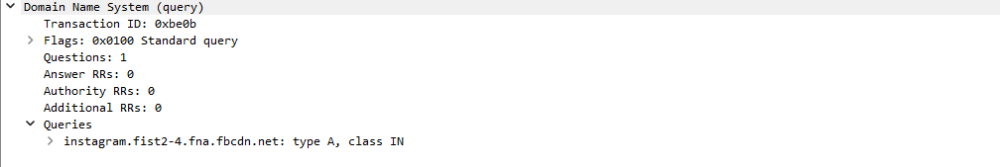
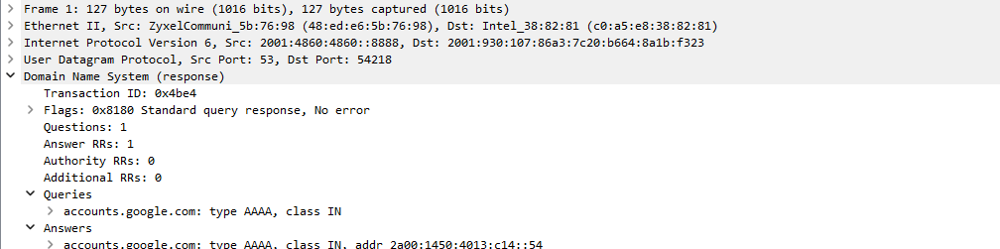
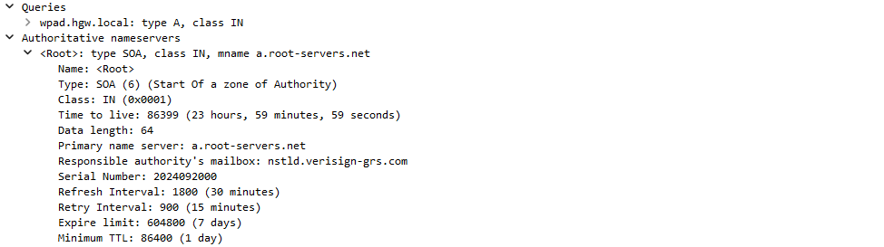
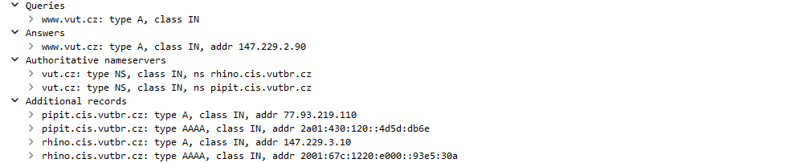
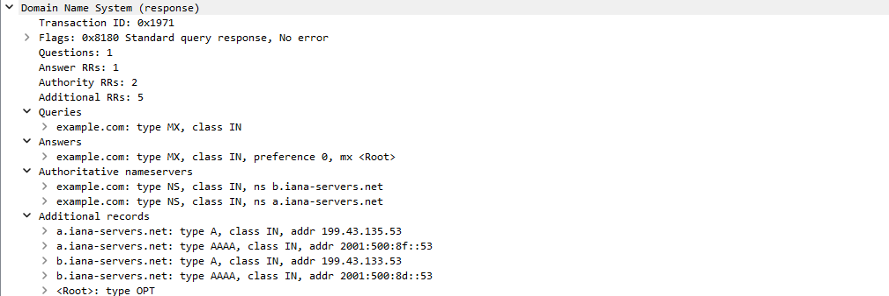

# Monitorování DNS komunikace

**Meno a priezvisko:** Matúš Janek

**Login:** 237464

## Obsah

1. [Úvod](#úvod)
2. [Teória](#Teória)
3. [Vstupné argumenty](#Vstupné-argumenty)
4. [Implementácia](#Implementácia)
    - [Štruktúra repozitára](#Štruktúra-repozitára)
    - [Spracovanie vstupných argumentov](#Spracovanie-vstupných-argumentov)
    - [Vytvorenie a spustenie filtru](#Vytvorenie-a-spustenie-filtru)
    - [Výpis zachytených pakiet](#Výpis-zachytených-pakiet)
5. [Ilustrovaná funkcionalita](#Ilustrovaná-funkcionalita)
6. [Testovanie](#Testovanie)
7. [Bibliografia](#Bibliografia)

## Úvod <a name="úvod"></a>

Táto dokumentácia slúži ako podrobný manuál k projektu `Monitorování DNS komunikace`, ktorý sa zameriava na implementáciu monitorovania DNS komuníkacie. Projekt umožňuje zachytávanie DNS sieťových paketov a ich následujúce spracovanie a písanie na výstup.

Dokumentácia obsahuje technické detaily implementácie, spôsoby použitia aplikácie a jej funkcionalít, ako aj postupy testovania a validácie implementovaných funkcií. Okrem toho sa tu nachádzajú aj informácie o doplnkových funkciách a prípadne zdroje, ktoré boli využité pri vytváraní projektu. Informácie o zadaní projektu viz. <a name="ref1">[1]</a>.

## Teória <a name="Teória"></a>

DNS je jedným z základných kameňov internetu, ktorý umožňuje prevod doménových mien na IP adresy a tým aj efektívnu komunikáciu medzi zariadeniami v sieti. DNS komunikácia prebieha najčastejšie cez protokol UDP, pričom samotné DNS správy obsahujú informácie o dotazoch (query) a odpovediach (response) na zadané doménové mená. DNS správy sa skladajú z niekoľkých sekcií, ktoré obsahujú rôzne informácie potrebné na spracovanie dotazov a odpovedí, tieto sekcie sú Header, Question, Authority a Additional. Pre viacej informácií o týchto sekciách viz. <a name="ref3">[3]</a>.

## Vstupné argumenty <a name="Vstupné-argumenty"></a>

Program je spúšťaný z príkazového riadka s nasledujúcimi parametrami:

`./dns-monitor (-i <interface> | -p <pcapfile>) [-v] [-d <domainsfile>] [-t <translationsfile>]`

Význam jednotlivých vstupných argumentov je špecifikovaný v zadaní viz. <a name="ref1">[1]</a>.

Tento program taktiež podporuje `-help` ktorý vypíše nápovedu, tento argument nesmenie byť zadaný s akýmkoľvek iným vstupným argumentom.

## Implementácia <a name="Implementácia"></a>

### Štruktúra repozitára <a name="Štruktúra-repozitára"></a>

Tento program obsahuje súbory `argument_parser.cpp/hpp` v ktorej je implementovaná trieda `Parser`  ktorá obsahuje atribúty zodpovedajúce jednotlivých vstupných argumentom a metódy a ich spracovanie. `packet_capturing.cpp/hpp` obsahuje triedu `Sniffer` ktorá obsahuje metódy na vytvorenie filtra. Súbory `packet_processing.cpp/hpp` obsahuje triedu `PacketProcessing` v ktorej sa nachádzajú statické metódy na spracovanie pakety. `utils.cpp/hpp` obsahuje pomocné funkcie pre výpis pakiet a niekoľko ďalších funkcionalít.

### Spracovanie vstupných argumentov <a name="Spracovanie-vstupných-argumentov"></a>

Vo funkcii main sa vytvorí inštancia triedy `Parser` ktorá obsahuje metódu pre zpracovanie vstupných argumentov. Následne sa zavolá jej metóda `parser.parse(argc, argv)` ktorá berie ako parametre pole argumentov a ich počet. Táto metóda zpracuje argumenty. Vstupné argumenty sa následne ukladajú do atribútov inštačnej metódy `parser`.

### Vytvorenie a spustenie filtru <a name="Vytvorenie-a-spustenie-filtru"></a>

Po úspešnom spracovaní vstupných argumentov sa vytvorí inštancia triedy `Sniffer` a následne sa zavolá metóda  `void run_sniffer(parser &parser)` alebo  `void run_pcap(parser &parser)` (záleží či spracovávame pakety zo vstupného súboru alebo rozhrania), ktorá berie ako parameter inštačnú triedu `parser`. AK pakety zaznamenávame z rozhrania tak sa inicializuje sniffer pomocou metódy `pcap_t* init_sniffer(parser& parser)` ktorá zahŕňa otvorenie sieťového rozhrania pomocou funkcie `pcap_open_live`. Po inicializácii sniffera sa volá metóda `void build_filter(parser& parser, pcap_t* handle)`, ktorá slúži na vytvorenie a nastavenie filtru pre zachytávanie DNS paketov. Pomocou `pcap_compile` a `pcap_setfilter` sa aplikuje filter na `handle`. Po úspešnej inicializácii a nastavení filtra sa spúšťa zachytávanie sieťových paketov volaním metódy `void capture_packets(parser &parser, pcap_t *handle)`. Táto metóda používa funkciu `pcap_loop`, ktorá kontinuálne zachytáva pakety. Pre viac popísaný význam jednotlivých funkcií filtru viz. <a name="ref1">[2]</a>.

### Výpis zachytených pakiet <a name="Výpis-zachytených-pakiet"></a>

Funkcia `PacketProcessing::parse_packet` je volaná v cykle, ktorý kontinuálne zachytáva pakety na základe nastavených parametrov sniffera. Najprv sa z hlavičky paketu získa časová značka, ktorá označuje čas, keď bol paket zachytený. Časová značka je formátovaná vo funkcii `void print_timestamp(const struct pcap_pkthdr *header, parser *parse)`, ktorá konvertuje čas z formátu štruktúry `pcap_pkthdr` do reťazca čitateľného pre človeka.

#### Získanie IP adresy
Počas spracovania paketu funkcia `void print_ip(const u_char *frame, parser *parse)` extrahuje zdrojovú a cieľovú IP adresu. V závislosti od verzie IP protokolu sa vyberie zodpovedajúca hlavička a IP adresy sú premenené na reťazec pomocou funkcie `inet_ntop`. Pre IPv4 sa používa štruktúra `ip`, zatiaľ čo pre IPv6 sa používa štruktúra `ip6_hdr`. Výsledné IP adresy sú následne vypísané, buď podrobne (`verbose` mód), alebo v skrátenom formáte.

#### Spracovanie portov
Funkcie `process_ipv4_port(const u_char *frame)` a `process_ipv6_port(const u_char *frame)` spracovávajú informácie o zdrojovom a cieľovom porte pre UDP pakety. Na základe verzie IP protokolu vypisujú tieto informácie, ak je zapnutý `verbose` mód. Tieto funkcie vypisujú zdrojový a cieľový port pre UDP.

#### Identifikátor a príznaky DNS
Funkcia `std::pair<const u_char*, uint8_t> print_identifier_and_flags(const u_char *frame, u_int16_t type, parser *parse)` extrahuje DNS hlavičku z UDP rámca a následne vypíše identifikátor DNS transakcie a jednotlivé príznaky. Ak je povolený `verbose` mód, vypisujú sa detaily ako QR, počet sekcií, a podobne. viz <a name="ref1">[3]</a>. 

#### DNS informácie
Funkcia `void print_dns_information(const u_char *frame, const u_char *pointer, parser *parse, uint8_t qr)` V tejto funkcii sa kontroluje či bol zadaný paramter `verbous`, ak áno tak sa vypíšú informácie v špecifikovanom formáte viz <a name="ref1">[2]</a>, následne sa volajú pomocné funkcie na zpracovanie DNS sections
pomocou funkcií `print_question_sections` a `print_other_sections`. Každá paketa je oddelená formátovacou čiarou (`=====================================`) pre lepšiu čitateľnosť výpisu, ak je zapnutý `verbose` mód.

#### Spracovanie DNS otázok
Funkcia `print_question_sections` spracováva DNS otázky, kde vypíše doménové meno, typ záznamu a triedu záznamu, ak je povolený `verbose` mód. Funkcia taktiež pridáva doménové mená do súboru, ak je to nastavené pomocou parametra `domains_file`, pre parsovanie mena sa volá funkcia `parse_data`.
V prípade zadania parametru -d sú doménové mená vypísané do výstupného súboru ktorého názov je špecifikovaný pri spustení. V prípade zadania -t parametru pri spustení sú doménové mená a ich preklady vypisované do výstupného súboru ktorý obsahuje preklady doménových mien na ip adresy.

#### Spracovanie ďalších sekcií
Funkcia `print_other_sections` spracováva záznamy v sekciách `Answer`, `Authority`, a `Additional`. Pre každý záznam vypíše meno, typ záznamu, triedu, TTL a ďalšie detaily. Pomocou funkcie `parse_rdata_and_print` sa následne spracuje obsah záznamov, čo zahŕňa rôzne typy DNS záznamov, ako napríklad A, AAAA, NS, MX a iné. V prípade zadania parametru -d sú doménové mená vypísané do výstupného súboru ktorého názov je špecifikovaný pri spustení. V prípade zadania -t parametru pri spustení sú doménové mená a ich preklady vypisované do výstupného súboru ktorý obsahuje preklady doménových mien na ip adresy.


***Funkcie su bližie definované v hlavičkových súboroch.***

## Ilustrovaná funkcionalita <a name="Ilustrovaná-funkcionalita"></a>

**Vytvorenie filteru**

```
void Sniffer::build_filter(parser &parser, pcap_t *handle)
{
    // Filter expression for DNS over UDP (port 53)
    std::string filter = "udp port 53";
    
    bpf_u_int32 net;
    bpf_u_int32 mask;
    struct bpf_program bpf_prog;

    if(!parser.interface.empty())
    {
        // Lookup network details (netmask, IP range, etc.) for the given interface
        if (pcap_lookupnet(parser.interface.c_str(), &net, &mask, errbuf) == PCAP_ERROR)
        {
            std::cerr << "Error: Looking up network: " << errbuf << std::endl;
            exit(EXIT_FAILURE);
        }
    }

    // Compile the filter expression
    if (pcap_compile(handle, &bpf_prog, filter.c_str(), 0, mask) == PCAP_ERROR)
    {
        std::cerr << "Error: Filter compiling: " << pcap_geterr(handle) << std::endl;
        exit(EXIT_FAILURE);
    }

    // Set the compiled filter
    if (pcap_setfilter(handle, &bpf_prog) == PCAP_ERROR)
    {
        std::cerr << "Error: Setting filter: " << pcap_geterr(handle) << std::endl;
        pcap_freecode(&bpf_prog); // Free the filter code if an error occurs
        exit(EXIT_FAILURE);
    }

    // Free the compiled filter after it's set
    pcap_freecode(&bpf_prog); 
}
```

**Parsovanie dát ako napríklad domain name**

```
std::pair<std::string, int> Utils::parse_data(const u_char *beginning_of_section, const u_char *packet_start)
{
    std::string data;
    const u_char *current_ptr = beginning_of_section;
    int lenght = 0;
    int offset = 0;
    // Get lenght of data that is goin to be parsed
    lenght = get_domain_name_length(current_ptr);

    // Loop till 0 value is occured
    while (*current_ptr != 0)
    {
        // Found reference
        if ((*current_ptr & 0xC0) == 0xC0)
        {
            // Get the next byte for the offset
            offset = ((*current_ptr & 0x3F) << 8);
            current_ptr += 1;
            offset |= *current_ptr; 
            current_ptr = packet_start + offset; 
        }
        else // Append the bytes into domain_name
        {
            int label_length = *current_ptr;
            current_ptr++;
            data.append((const char *)current_ptr, label_length);
            current_ptr += label_length;
            if (*current_ptr != 0)
            {
                data.append(".");
            }
        }
    }

    // Add the final dot if it's not there yet
    if (data.back() != '.')
    {
        data.append(".");
    }
    return std::make_pair(data, lenght);
}
```


## Testovanie <a name="Testovanie"></a>

**Testovacie prostredie:** WSL.

*Program bol úspešne testovaný pomocou vstupných .pcap súborov a ich následovné porovnávanie v aplikácii wireshark.*

### Record type A (Question section) 

```
2024-09-20 12:03:45 SrcIP: 2001:930:107:86a3:7c20:b664:8a1b:f323 -> DstIP: 2001:4860:4860::8888 (Q 1/0/0/0)
```

#### `verbous`

```
Timestamp: 2024-09-20 12:03:45
SrcIP: 2001:930:107:86a3:7c20:b664:8a1b:f323
DstIP: 2001:4860:4860::8888
SrcPort: UDP/52561
DstPort: UDP/53
Identifier: 0xbe0b
Flags: QR=0, OPCODE=0, AA=0, TC=0, RD=1, RA=0, AD=0, CD=0, RCODE=0

[Question Section]
instagram.fist2-4.fna.fbcdn.net. IN A
=====================================
```



### AAAA (Question and Answer section) 

```
2024-09-20 13:34:53 SrcIP: 2001:4860:4860::8888 -> DstIP: 2001:930:107:86a3:7c20:b664:8a1b:f323 (R 1/1/0/0)
```

#### `verbous`

```
Timestamp: 2024-09-20 13:34:53
SrcIP: 2001:4860:4860::8888
DstIP: 2001:930:107:86a3:7c20:b664:8a1b:f323
SrcPort: UDP/53
DstPort: UDP/54218
Identifier: 0x4be4
Flags: QR=1, OPCODE=0, AA=0, TC=0, RD=1, RA=1, AD=0, CD=0, RCODE=0

[Question Section]
accounts.google.com. IN AAAA

[Answer Section]
accounts.google.com. 20 IN AAAA 2a00:1450:4013:c14::54
=====================================
```



### SOA (Authority section) A (Question section)

```
2024-09-20 12:04:33 SrcIP: 2001:4860:4860::8888 -> DstIP: 2001:930:107:86a3:7c20:b664:8a1b:f323 (R 1/0/1/0)
```

#### `verbous`

```
Timestamp: 2024-09-20 12:04:33
SrcIP: 2001:4860:4860::8888
DstIP: 2001:930:107:86a3:7c20:b664:8a1b:f323
SrcPort: UDP/53
DstPort: UDP/53250
Identifier: 0x4256
Flags: QR=1, OPCODE=0, AA=0, TC=0, RD=1, RA=1, AD=0, CD=0, RCODE=3

[Question Section]
wpad.hgw.local. IN A

[Authority Section]
. 86399 IN SOA a.root-servers.net. nstld.verisign-grs.com. 2024092000 1800 900 604800 86400
=====================================
```



### NS (Authority section), A, AAAA (Additional, Answer, Question section)

```
2024-09-25 11:55:31 SrcIP: 147.229.191.143 -> DstIP: 147.229.193.87 (R 1/1/2/4)
```

#### `verbous`

```
Timestamp: 2024-09-25 11:55:31
SrcIP: 147.229.191.143
DstIP: 147.229.193.87
SrcPort: UDP/53
DstPort: UDP/53760
Identifier: 0xb4e1
Flags: QR=1, OPCODE=0, AA=0, TC=0, RD=1, RA=1, AD=0, CD=0, RCODE=0

[Question Section]
www.vut.cz. IN A

[Answer Section]
www.vut.cz. 68 IN A 147.229.2.90

[Authority Section]
vut.cz. 68 IN NS rhino.cis.vutbr.cz.
vut.cz. 68 IN NS pipit.cis.vutbr.cz.

[Additional Section]
pipit.cis.vutbr.cz. 283 IN A 77.93.219.110
pipit.cis.vutbr.cz. 283 IN AAAA 2a01:430:120::4d5d:db6e
rhino.cis.vutbr.cz. 68 IN A 147.229.3.10
rhino.cis.vutbr.cz. 68 IN AAAA 2001:67c:1220:e000::93e5:30a
=====================================
```


### MX (Answer and Question section), A, AAAA (Additional section), NS (Authority section)

```
2024-09-25 12:39:10 SrcIP: 147.229.191.143 -> DstIP: 147.229.193.87 (R 1/1/2/5)
```

#### `verbous`

```
Timestamp: 2024-09-25 12:39:10
SrcIP: 147.229.191.143
DstIP: 147.229.193.87
SrcPort: UDP/53
DstPort: UDP/50249
Identifier: 0x1971
Flags: QR=1, OPCODE=0, AA=0, TC=0, RD=1, RA=1, AD=0, CD=0, RCODE=0

[Question Section]
example.com IN MX

[Answer Section]
example.com 86400 IN MX 0 <root>

[Authority Section]
example.com 72806 IN NS b.iana-servers.net
example.com 72806 IN NS a.iana-servers.net

[Additional Section]
a.iana-servers.net 60 IN A 199.43.135.53
a.iana-servers.net 60 IN AAAA 2001:500:8f::53
b.iana-servers.net 60 IN A 199.43.133.53
b.iana-servers.net 60 IN AAAA 2001:500:8d::53
=====================================
```



## Bibliografia <a name="Bibliografia"></a>

[1]: Radek Hranický. (2024). Monitorování DNS komunikace , ISA Projects 2024 [online]. Publisher: Brno University of Technology. Retrieved September 20, 2024, [cit. 2024-09-25] Available at: https://www.vut.cz/studis/student.phtml?script_name=zadani_detail&apid=280945&zid=58123

[2]: ENGRSALMANSHAIKH . (DECEMBER 9, 2014). NETWORK PACKET SNIFFER C++ [online]. Publisher: UNCATEGORIZED . Retrieved September 20, 2024, [cit. 2024-09-25] Available at: https://engrsalmanshaikh.wordpress.com/2014/12/09/network-packet-sniffer-c/

[3]: CS4700/CS5700 . (JANUARY 24, 2011). Simple DNS Client [online]. Publisher: UNCATEGORIZED . Retrieved September 20, 2024, [cit. 2024-09-25] Available at: https://mislove.org/teaching/cs4700/spring11/handouts/project1-primer.pdf